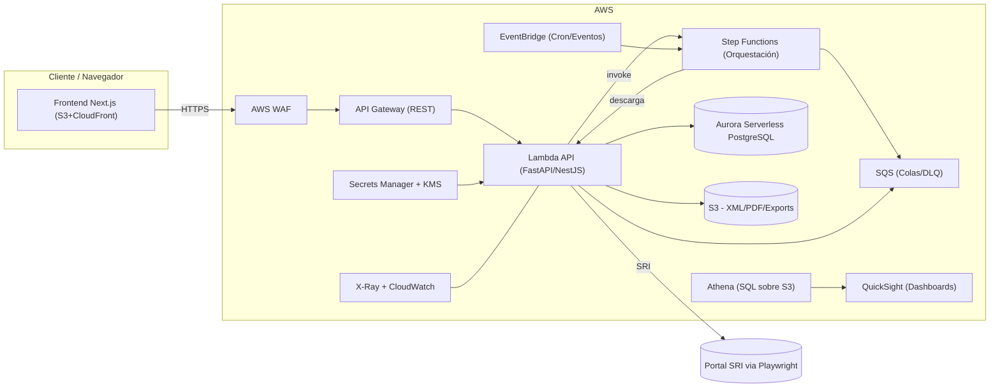
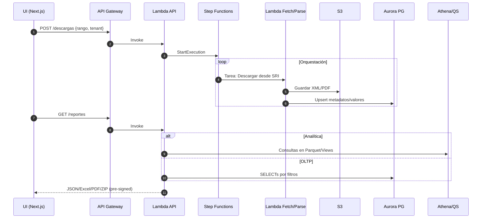
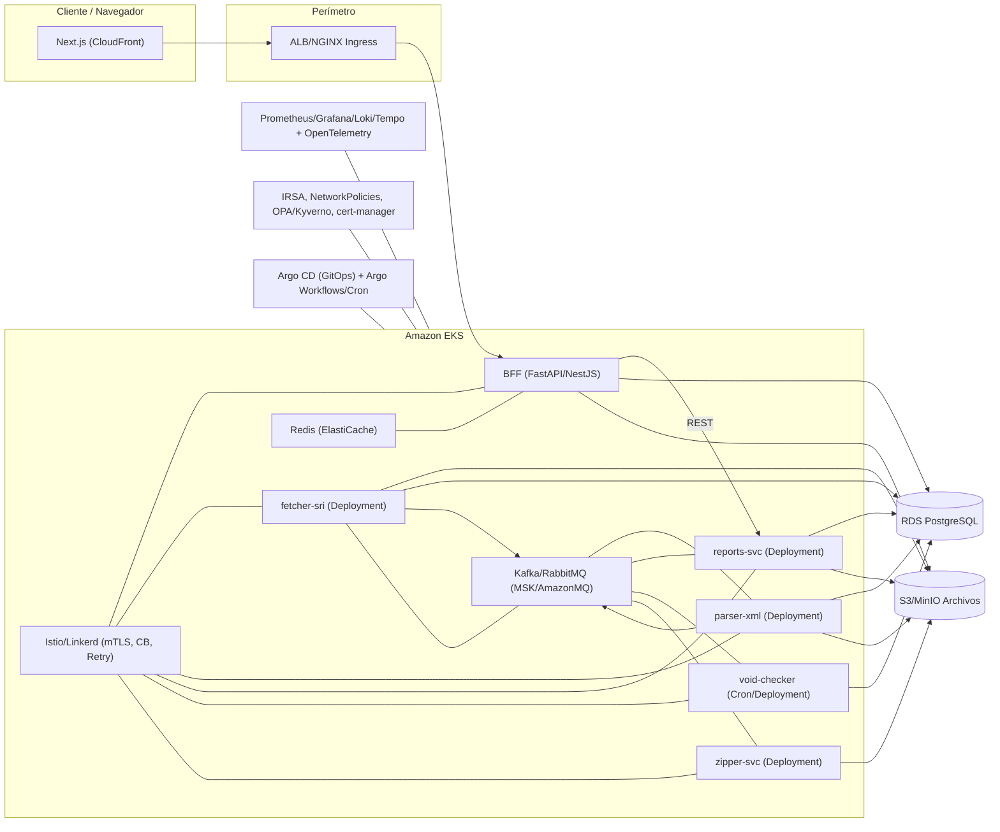
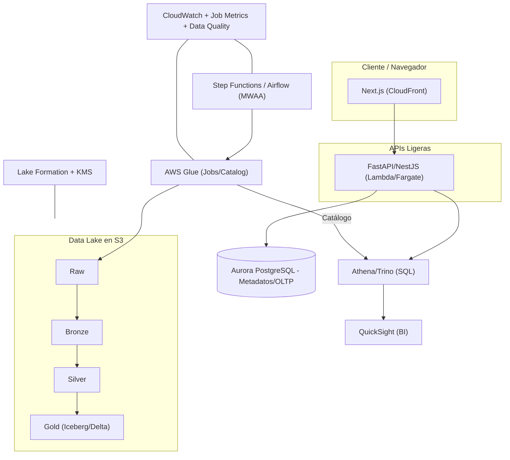
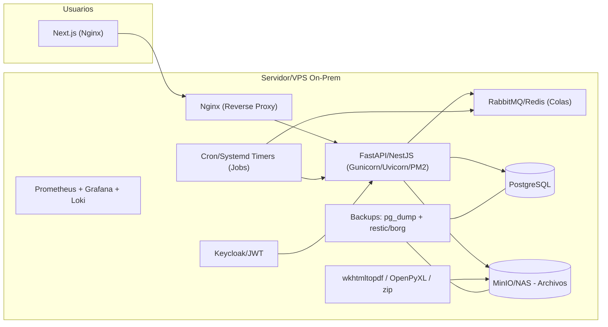
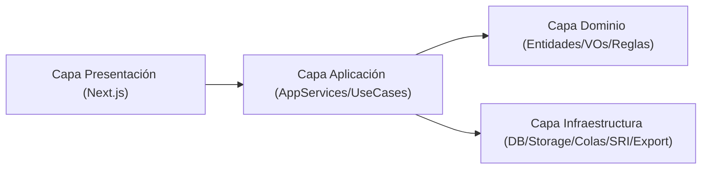
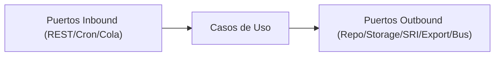

# Diagramas de Arquitectura (Estilo Arquitecto de Soluciones)

> Nota: Los siguientes diagramas están en **Mermaid**. Puedes pegarlos en cualquier visor/editor compatible (como Draw.io/Excalidraw mermaid plugin, GitHub, Obsidian o VS Code con extensión Mermaid) para visualizarlos.

---

## 1) Serverless (AWS) — Alto nivel (Componentes)



### Flujo principal (Descarga → Parseo → Persistencia → Reporte)


---

## 2) Microservicios en Contenedores (ECS Fargate) — Alto nivel

```mermaid
flowchart TB
  subgraph Client["Cliente / Navegador"]
    UI["Next.js (S3+CloudFront)"]
  end

  subgraph Edge["Perímetro"]
    APIG["API Gateway"]
  end

  subgraph ECS["ECS Fargate Cluster"]
    BFF["bff-api (NestJS/FastAPI)"]
    FETCH["fetcher-sri (Playwright)"]
    PARSE["parser-xml"]
    RPT["reports-svc"]
    VOID["void-checker"]
    ZIP["zipper-svc"]
  end

  SQS["SQS (work queues)"]
  SNS["SNS (notificaciones)"]
  DB[(RDS PostgreSQL)]
  S3[(S3 Archivos)]
  REDIS[ElastiCache (Redis)]
  OBS["CloudWatch / X-Ray"]
  SEC["Secrets Manager / KMS"]

  %% flujo cliente -> API -> BFF
  UI --> APIG --> BFF

  %% BFF acceso a datos y publicación de jobs
  BFF --> DB
  BFF --> S3
  BFF --> SQS

  %% fetcher descarga y publica trabajos
  FETCH --> S3
  FETCH --> DB
  FETCH --> SQS

  %% consumidores de colas
  SQS --> PARSE
  SQS --> RPT
  SQS --> VOID
  SQS --> ZIP

  %% servicios a datos/archivos
  PARSE --> DB
  PARSE --> S3
  RPT --> DB
  RPT --> S3
  VOID --> DB
  ZIP --> S3

  %% notificaciones
  ZIP --> SNS

  %% cache
  REDIS --- BFF

  %% observabilidad (líneas separadas por servicio)
  OBS --- BFF
  OBS --- FETCH
  OBS --- PARSE
  OBS --- RPT
  OBS --- VOID
  OBS --- ZIP

  %% secretos/cifrado (líneas separadas por servicio)
  SEC --> BFF
  SEC --> FETCH
  SEC --> PARSE
  SEC --> RPT
  SEC --> VOID
  SEC --> ZIP
```

---

## 3) Kubernetes Gestionado (EKS) + GitOps — Alto nivel



---

## 4) Lakehouse (S3 + Glue + Athena/Trino) + APIs Ligeras — Alto nivel



---

## 5) Solo Web / On-Prem / VPS — Alto nivel



---

## Anexos — Capas/Responsabilidades (Capas o Hexagonal)




